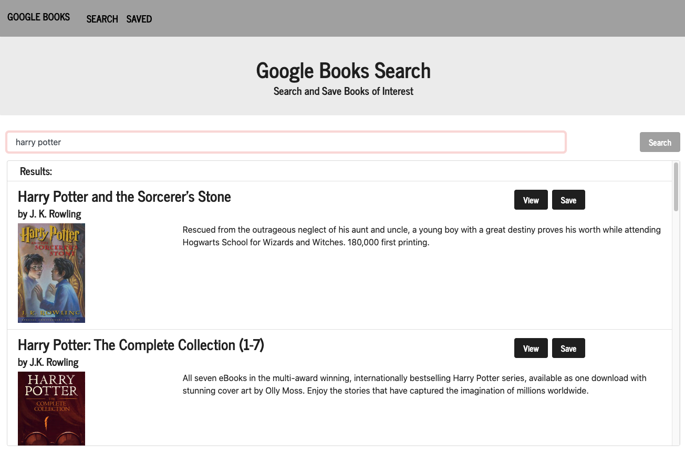

<h1 align="center"> GOOGLE BOOK SEARCH </h1> 

 

  

  
### Description
With this application, you will be able to use a search box to display results of Google Books API. In addition, you will be able to save your favorite books and retrieve them in a different component. All the functionalities were created by using React, JavaScript, Bootstrap, and MongoDB.

### Table of Contents

  * [Installation](#installation)
  * [Usage](#usage)
  * [Credits](#credits)
  * [License](#license)
  * [Contributing](#contributing)
  * [Questions](#questions)

### Installation
This app is completely deployed using GitHub: [Deployed Link](https://acosta-andres-r.github.io/employee-directory/)

### Usage

Demo

### License

Copyright (c) Andres Acosta. All rights reserved.
Licensed under the [MIT license](LICENSE).

### Credits

👤 **Andres Acosta** (author): [GitHub](https://github.com/acosta-andres-r)

### Contributing
Please note that this project is released with a [Contributor Code of Conduct](CODE_OF_CONDUCT.md). By participating in this project you agree to abide by its terms.

### Questions
 For more information, additional questions or comments, please contact [Andres Acosta](https://github.com/acosta-andres-r).

